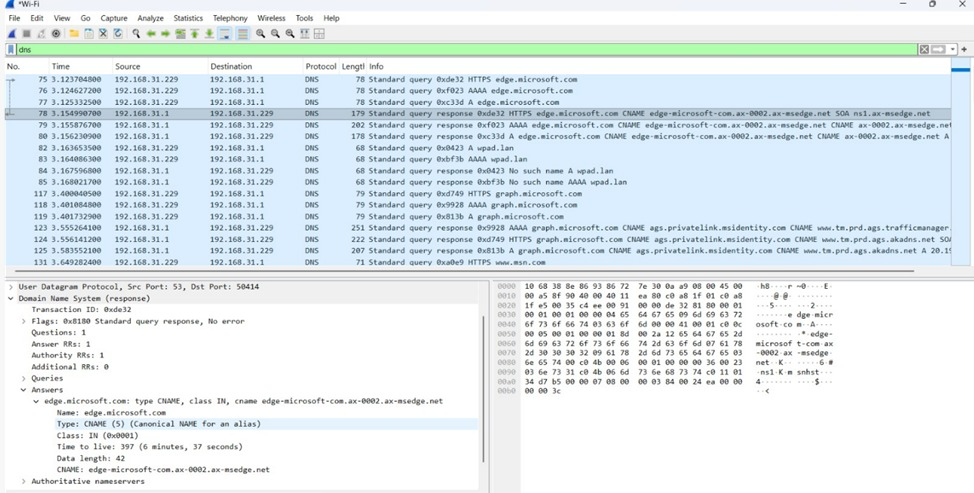
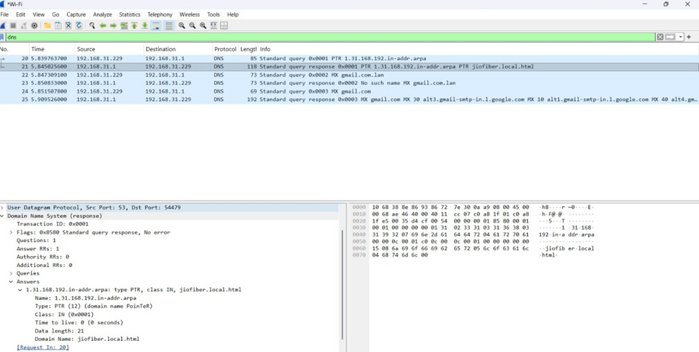
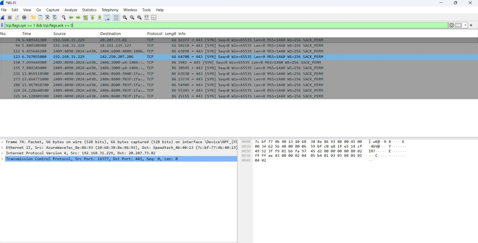

# Day 2 — DNS, DHCP, TCP Handshake, Nmap

## DNS Resolution Process

1. Browser Cache
2. OS Cache + Hosts File
3. Recursive Resolver
4. Root Nameserver
5. TLD Server
6. Authoritative Nameserver

### Important DNS Records

| Record | Purpose |
|---|---|
| A | Domain → IPv4 |
| AAAA | Domain → IPv6 |
| CNAME | Alias record |
| MX | Mail server |
| TXT | SPF/DKIM/DMARC |
| PTR | Reverse DNS |


## DHCP DORA Process

1. Discover
2. Offer
3. Request
4. Acknowledge

### SOC Relevance
- Rogue DHCP servers
- Malicious DNS redirection
- MITM attacks

## TCP 3-Way Handshake

Step 1: SYN  
Client requests connection.

Step 2: SYN-ACK  
Server acknowledges request.

Step 3: ACK  
Client confirms connection.

# Ports and Protocols Cheat Sheet

| Port | Protocol | Service | SOC Relevance |
|---|---|---|---|
| 53 | UDP/TCP | DNS | DNS tunneling, malware C2 |
| 67 | UDP | DHCP Server | IP assignment |
| 68 | UDP | DHCP Client | DHCP communication |
| 80 | TCP | HTTP | Web traffic monitoring |
| 443 | TCP | HTTPS | Encrypted web traffic |
| 22 | TCP | SSH | Remote administration |


## Nmap Commands Practiced

```bash
nmap 127.0.0.1
nmap -sS 127.0.0.1
```

## Wireshark Filter Used

```text
tcp.flags.syn == 1
```
---

## Screenshots

### DNS Query Capture


### MX Record Lookup


### SYN Packet Filter

## What I Learned Today

- How DNS resolution works
- DHCP DORA process
- Basics of TCP handshake
- SYN packets in Wireshark
- Intro to Nmap scanning
